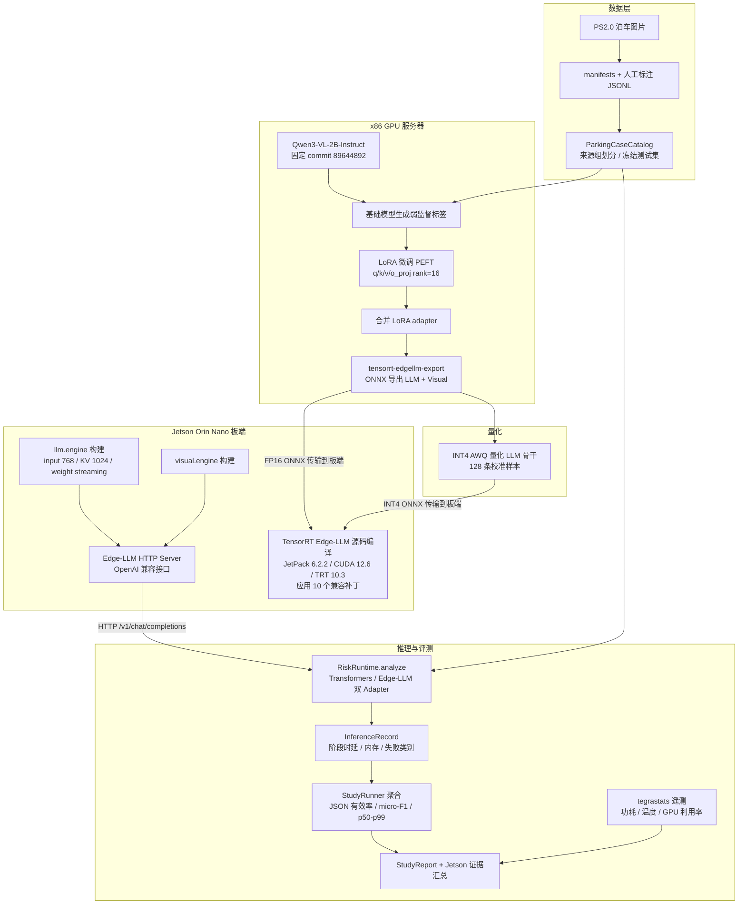

# ParkSight-VLM 面试讲解笔记

> 用途：面试准备（端侧 AI 部署岗位）。本文整合项目定位、技术栈、架构、核心难点、实测数据和面试问答，
> 并包含技术栈流程图。项目最新状态以 `docs/status.md` / `docs/progress.md` 为准；
> `docs/record.md` 是分阶段学习记录，面试叙述请使用最终结论（LoRA 与 INT4 已完成）。

## 1. 30 秒电梯陈述

这个项目是一个**端侧 VLM 部署全链路项目**：基于 Jetson Orin Nano 和 NVIDIA TensorRT Edge-LLM，
把 Qwen3-VL-2B 部署成低速泊车场景的风险理解系统——输入一张泊车图片，输出结构化的泊车风险 JSON
（风险等级、风险事件、证据、驾驶建议）。我完整走通了 **数据准备 → LoRA 领域微调 → INT4 AWQ 量化
→ ONNX 导出 → TensorRT engine 构建 → 板端推理 → 质量/性能/功耗评测** 的闭环，
并形成了严格可复现、可审计的实验证据体系。

关键词：Jetson、TensorRT Edge-LLM、Qwen3-VL、LoRA、量化、端侧部署、评测体系。

## 2. 项目主线（架构层）

```text
ParkingCase -> RiskRuntime -> InferenceRecord -> StudyReport
```

| 对象 | 职责 | 面试要点 |
| --- | --- | --- |
| `ParkingCase` | 图片 + 来源组 + 数据集划分 + 人工标注 | 用 `source_group_id` 做防泄漏划分 |
| `ParkingAssessment` | 模型输出的**严格 JSON 校验** | 字段、类型、枚举全部校验，失败明确分类 |
| `RiskRuntime` | 屏蔽后端差异的抽象接口 | Transformers / Edge-LLM 双 Adapter，可插拔 |
| `InferenceRecord` | 一次推理的全部事实 | 输入身份、运行时身份、时延、失败类别 |
| `StudyReport` | 冻结工作负载上的聚合报告 | 质量 + 性能 + 环境 + 失败归因 |

**设计亮点**：`ParkingAssessment` 既是人工标注格式、又是模型输出解析格式，一套数据类型贯穿
「标注 → 推理 → 评测 → 错误归因」，不依赖自然语言的模糊解释。

## 3. 三个实验角色（评测方法论核心）

| 实验 | 环境 | 用途 | 关键规则 |
| --- | --- | --- | --- |
| 服务器 Transformers | x86 GPU 服务器（RTX 4090） | 正确性参考、误差分析、LoRA 训练 | **不参与** Jetson 性能结论 |
| Jetson Transformers FP16 | Jetson Orin Nano | 板端原生框架基线 | 与 Edge-LLM **同机**比较 |
| Jetson TensorRT Edge-LLM | Jetson Orin Nano | 最终部署 runtime | FP16 / INT4 部署优化 |

核心原则：**服务器性能不证明 Jetson 加速收益；加速结论只来自 Jetson 同机实验**。
三个实验固定相同模型 commit、workload、数据集、生成参数、功耗模式。

## 4. 技术栈分层

### 4.1 模型层
- **Qwen3-VL-2B-Instruct**：多模态 VLM，固定在不可变 commit `89644892…`
- **LoRA 微调（PEFT）**：只微调语言骨干 `q/k/v/o_proj`，rank=16 / alpha=32 / dropout=0.05，
  仅 **0.3% 参数**，4090 上 1 epoch 约 21 秒训完
- **弱监督数据**：基础模型在 PS2.0 训练集上自生成 80 条通过严格 JSON 校验的标签，
  与冻结测试集零重叠
- **INT4 AWQ 量化**：`tensorrt-edgellm-quantize`，LLM 骨干 INT4 + 视觉编码器 FP16，
  128 条通用文本校准

### 4.2 部署层（最硬核部分）
```text
HF 模型 → tensorrt-edgellm-export（LLM + Visual 两份 ONNX）
       → Jetson 编译 TensorRT Edge-LLM v0.9.1（固定 commit + 10 个补丁）
       → llm_build / visual_build 构建 engine（input 768 / KV 1024 / weight streaming）
       → Edge-LLM HTTP Server（OpenAI 兼容接口）→ 推理
```

关键参数：`maxInputLen=768`、`maxKVCacheCapacity=1024`、builder workspace 1024 MiB、
优化级别 0、weight streaming 启用。

### 4.3 评测层
- **质量**：严格 JSON 有效率、风险等级准确率、事件 micro precision/recall/F1、不安全建议率、按事件错误
- **性能**：preprocess / vision / prefill / decode / 端到端 p50/p90/p99、TTFT、tokens/s、冷启动
- **资源**：解析 `tegrastats` 日志 → RAM / SWAP / GPU 利用率 / GPU 温度 / 输入功耗（VDD_IN）

### 4.4 工程层
- 40 个无硬件 `unittest`（模块 Interface 级测试，不需要模型权重）
- `flows.py`：训练/合并/量化/导出/构建建模为「命令 + 输入 + 期望输出 + record/log」，
  执行前 readiness 校验，计划 SHA-256 定身份
- 失败分类记录（JSON 解析失败 / 拒答 / 超时 / OOM / 算子不支持…），不掩盖失败
- paramiko SSH/SFTP 远程运维、AutoDL 云 GPU 训练、SHA-256 校验模型包

## 5. 技术栈流程图（Mermaid）



## 6. 核心难点与解决过程（面试讲故事环节）

### 难点 1：Jetson 环境陷阱
- 通用 aarch64 torch wheel 只含 `sm_80/sm_90`，**不含 Orin Nano 的 `sm_87`**
  → 用 Jetson AI Lab 官方 wheel（torch 2.9.1+cu126，arch list 只含 `sm_87`）
- `import torch` 缺 `libcudss.so.0` → 补 `nvidia-cudss-cu12`；
  `AutoVideoProcessor` 依赖 torchvision → 装配套 0.24.1
- JetPack 6.1 → 6.2.2 升级，L4T R36.5.0 / CUDA 12.6 / TensorRT 10.3

### 难点 2：TensorRT Edge-LLM 与 JetPack 6 的兼容性
- 固定上游 commit `7f061f21…` 不动，写 **10 个补丁**适配：TensorRT 10.3 stream reader 接口、
  CuteDSL 兼容、禁用 FP4 插件格式、可配置 builder 内存、weight streaming、
  先分配 context 再加载视觉 runner 等
- **FMHA CUBIN 问题**：11 个 SM87 CUBIN 中 9 个可加载、2 个被驱动拒绝
  （head_size=256+custom_mask），而 Qwen3-VL 实际 head_size=128
  → 补丁只跳过被明确拒绝且无用的 CUBIN
- 金句：**上游源码不动，兼容性改动全部以补丁形式保存，保证实验身份可复现**

### 难点 3：8GB 统一内存上的 engine 构建与加载 OOM
- LLM engine 构建 6 次失败（plugin 路径 → FMHA → 优化级别 → workspace → headless → weight streaming），
  内核日志证明 OOM killer → 8 GiB 临时文件 swap + workspace 1024 MiB + 优化级别 0
- 运行时双 engine 加载：默认 weight streaming 关闭，3.44 GB streamable weights 一次性驻留 GPU → OOM
  → **补丁在创建 context 前调用 `setWeightStreamingBudgetV2(0)`**，权重按需流式加载
- 视觉 engine 811 MB 分配失败：4 步排查（清 cache / 清 zram / 停服务 / 换 Base engine 复现）
  → 定位 NvMap 连续内存问题 → **headless 模式（`multi-user.target`）+ 内存 compaction** 解决，
  NvMap clients 从 34 MB 降到 0
- 金句：**`free` 显示的内存可用 ≠ NvMap 能分配连续统一内存块；要看 available、swap 实际使用和内核日志**

### 难点 4：两条 Runtime 的 Prompt 契约不一致（TDD 案例）
- 症状：Transformers 20/20 JSON 有效，Edge-LLM 20/20 HTTP 完成但 **0/20 JSON 有效**
  （数组字段全变成字符串）
- 排查：写 `inspect_prompt_contract.py` 诊断工具，只加载 processor 不加载模型，
  对比两条路径的 messages、渲染文本、chat template 的 SHA-256
- 发现：Edge-LLM 的 system message 是普通字符串，Transformers 是 typed content array → 最小对齐修复
- 用 **TDD** 流程：先写 red 测试（要求 Edge system content 为数组）→ 修复 → green；40 个测试通过
- 金句：**HTTP 200 只证明后端完成，严格 JSON 校验通过才证明业务输出成功**

### 难点 5：INT4 量化的性能与质量权衡
- INT4 相对 FP16：端到端延迟 53.64s → 10.69s（约 5x）、engine 体积 -60.5%、RAM 峰值 -31.6%
- 但通用文本校准（cnn_dailymail 128 条）导致事件 micro-F1 **退化为 0**
- 诚实结论：部署性能收益真实，但质量退化，不能作为最终版本，需要领域图文校准集
- 金句：**部署成功 ≠ 业务达标，把 runtime 成功与任务质量分开记录**

## 7. 实测成果数据

**最终状态（08-13 后，以 status.md / progress.md 为准）：**

| 版本 | JSON 有效率 | 事件 micro-F1 | 端到端 p50 | 备注 |
| --- | --- | --- | --- | --- |
| Jetson Base FP16 | 20/20 (100%) | 0.359 | 50.75s | prompt 修复 + i768/k1024 engine |
| Jetson LoRA FP16 | 20/20 (100%) | **0.389** | 30.60s | 车辆事件假阳性 3→1；延迟下降主要因输出变短 |
| Jetson INT4 AWQ | 20/20 (100%) | **0（退化）** | **10.69s（约 5x）** | engine -60.5%、RAM -31.6%、功耗均值约 10W |

配套遥测：GPU 利用率均值 97–99%、输入功耗均值约 10W（15W 模式）、GPU 峰温约 65°C。

> 注意：record.md 中 08-10 的「Edge-LLM 0/20 JSON、p50 41.758s」是 prompt 契约修复**之前**的数据；
> 面试讲修复后的 20/20 状态，把修复过程作为故事讲。

## 8. 面试高频问题与参考回答

**Q1：为什么选 TensorRT Edge-LLM 而不是 vLLM？**
> 目标是 8GB 统一内存的 Jetson，vLLM 的显存占用和依赖不适合。Edge-LLM 是 NVIDIA 为 Jetson
> 定制的推理引擎，支持 weight streaming（权重流式加载）、CUDA graph、多模态 VLM 的
> LLM + 视觉双 engine，INT4 AWQ 也是官方路径。代价是生态较新，需要针对 JetPack 6 打兼容补丁。

**Q2：TensorRT 为什么反而比 Transformers 慢？**
> 因为 8GB 内存上必须用 `weight-streaming-budget=0` 加载双 engine，权重每次按需从内存流式访问，
> 加上 1.24GB scratch 和执行上下文开销。这恰恰说明：**TensorRT 不天然等于快，内存受限时的取舍
> 会抵消优化收益**；INT4 把权重缩小后才真正体现加速（5x）。

**Q3：LoRA 为什么只微调语言骨干？**
> Qwen3-VL 是「视觉编码器 + 语言骨干」结构。领域风险判断能力主要在语言侧，微调视觉编码器
> 参数多、收益小、易过拟合；0.3% 参数 21 秒训完，且合并后能直接走 ONNX/量化链路。

**Q4：怎么保证实验可复现？**
> 四重固定：模型 commit、TensorRT Edge-LLM commit、workload SHA-256、数据集版本，
> 加环境快照（L4T / CUDA / torch / 功耗模式）；所有外部流程有 readiness 校验和 plan 身份哈希；
> 失败也保存类别和原始日志。

**Q5：项目最大的不足？**
> 20 样本冻结测试集太小且单人标注；弱监督标签偏向 `narrow_passage`；风险等级准确率只有 35%、
> `visibility_occlusion` 全部漏检；INT4 校准集不匹配导致质量退化。这些如实记录在 status.md——
> 面试官问缺点时主动说，比被问出来强。

## 9. 面试定位建议

- 最值钱的部分是 **Jetson 上真实跑通的部署链路**（编译、打补丁、OOM 排查、遥测），
  大多数候选人只做过服务器端推理，这是差异化点
- 第二个差异化点是**评测方法论**：严格 JSON 契约、失败分类、同机对比、区分 runtime 成功与业务达标
- 讲故事顺序：**先讲链路全貌（30 秒）→ 讲一个最深的技术难点（OOM 或 prompt 契约，10 分钟）
  → 讲数据成果 → 主动讲局限**

## 10. 相关文档索引

- `docs/status.md` — 当前实现状态与实测证据（最新结论）
- `docs/progress.md` — 环境、命令、版本快照
- `docs/record.md` — 分阶段完整学习与执行记录
- `docs/architecture.md` — 系统架构
- `docs/evaluation.md` — 评测口径
- `docs/edgellm-deployment.md` — TensorRT Edge-LLM 部署手册
- `docs/execution-report.md` — 命令、结果与证据审计
